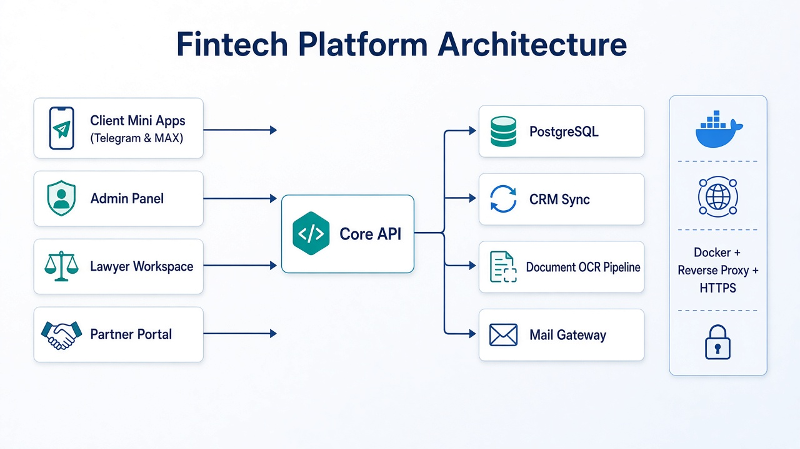

# 💻 Development Portfolio

Full-stack work on a **commercial fintech / credit-consulting platform** (~2 years): client apps, core API, CRM integrations, lawyer tools, partner commissions, and self-hosted production infrastructure.

> **Confidentiality:** Source code, secrets, env files, webhooks, and client data are **not** published (NDA / production safety).  
> This folder contains **case studies**, architecture overview, and **public login-screen** screenshots only.

## Projects

| Project | Status | Stack (high level) | Link |
|---------|--------|--------------------|------|
| [Core API](./core-api/) | Production | C# · ASP.NET Core · PostgreSQL | [Open](./core-api/) |
| [Client Mini App](./client-mini-app/) | Production | React · TypeScript · Telegram/MAX | [Open](./client-mini-app/) |
| [Admin Panel](./admin-panel/) | Production | React · TypeScript | [Open](./admin-panel/) |
| [Lawyer Workspace](./lawyer-workspace/) | Production | FastAPI · Documents · CRM | [Open](./lawyer-workspace/) |
| [Partner Program](./partner-program/) | Production | Django · React · Webhooks | [Open](./partner-program/) |
| [Bureau Automation](./bureau-automation/) | Production (optional robot) | FastAPI · OCR · Mail agent | [Open](./bureau-automation/) |
| [Production Infrastructure](./production-infra/) | Production | Docker · Traefik · Mail · DNS | [Open](./production-infra/) |
| [Credit Enot](./credit-enot/) | **In development** | React Native · ASP.NET · Python | [Open](./credit-enot/) |

## What I owned

- End-to-end product delivery (not only features — also deploys, incidents, runbooks)
- Multi-stack production on a single self-hosted server
- CRM pipeline safety (funnel guards, commission integrity)
- Dual-platform mini apps (Telegram + MAX)

## Skills demonstrated

`C#` · `ASP.NET Core` · `Python` · `FastAPI` · `Django` · `React` · `TypeScript` · `React Native` · `PostgreSQL` · `Docker` · `Traefik` · `Bitrix24` · `Telegram Mini Apps` · `OCR` · `JWT` · `Webhooks`

## Screenshot policy

Real UI captures from public login screens, OpenAPI docs, demo/fixture client flows, and infra status boards.

**Excluded on purpose:** authenticated client cabinets with real PII, deal PDFs, letters, `.env`, tokens, webhook URLs.

