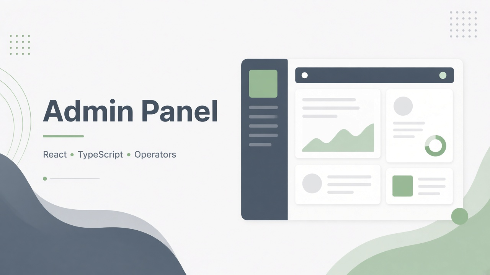
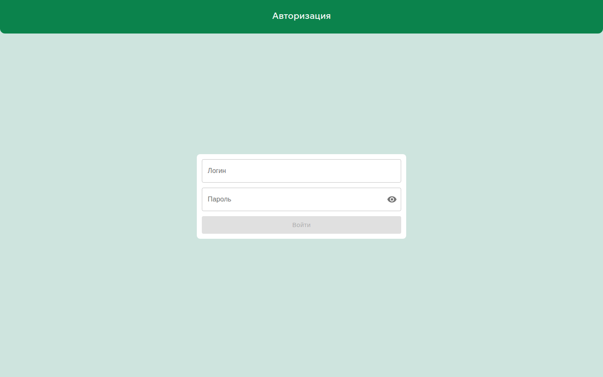

# Admin Panel (Operators)

## Screenshots

Public authentication screen only.

**Role:** Frontend  
**Status:** Production  
**Stack:** React · TypeScript · Vite · MUI

## Overview

Internal tool for operators: authenticate, open deals, correct client data, manage statuses — talks to the Core API.

## What I built

- Login and deal-editing UI for day-to-day support
- API routing for office LAN vs public HTTPS builds
- Operator workflows that reduce routine CRM clicking

## Results

- Operators can fix common deal issues from one panel
- Same design language as other React apps in the suite

## Hard problem

**Wrong API host when opening admin by LAN IP** — login worked visually but calls failed.  
**Fix:** auto-route LAN → local API port; domain builds use HTTPS API via build-time env (rebuild required after env change).

## Confidentiality

Screenshot shows **public login UI only** (no client records).
