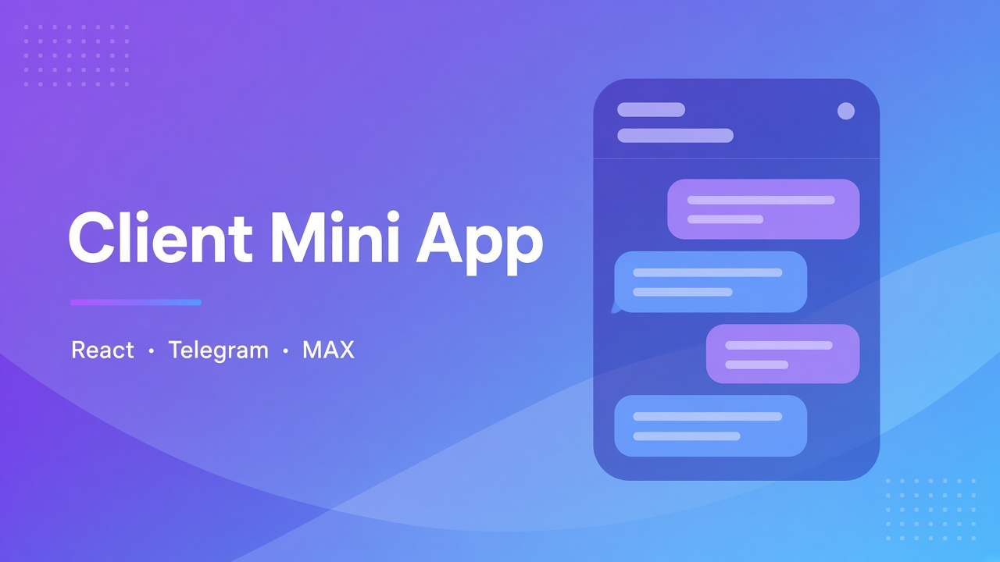

# Client Mini App (Telegram + MAX)

**Role:** Frontend / product delivery  
**Status:** Production  
**Stack:** React · TypeScript · Vite · MUI · React Query · Telegram & MAX WebApp bridges

## Overview

Client cabinet inside messengers: onboarding without a separate native app store release.

## What I built

- Full client journey: registration → certificate → e-signature → bureau report upload → deal status
- One codebase for **Telegram Mini App** and **MAX Mini App**
- Platform adapter / bridge layer for launch params and user identity
- Production deploys via Docker images (with version boot-markers)

## Results

- Self-serve onboarding for end clients
- Dual-platform delivery without maintaining two products

## Hard problem

**MAX webview broke when Telegram SDK was injected** — infinite loaders / “failed to get profile”.  
**Fix:** platform-specific bridge, never load Telegram scripts in MAX, boot markers, and mandatory image rebuilds (hotfixes via `docker cp` disappeared after recreate).

## Confidentiality

No source code or secrets. UI of authenticated client cabinets is not shown (PII risk).
