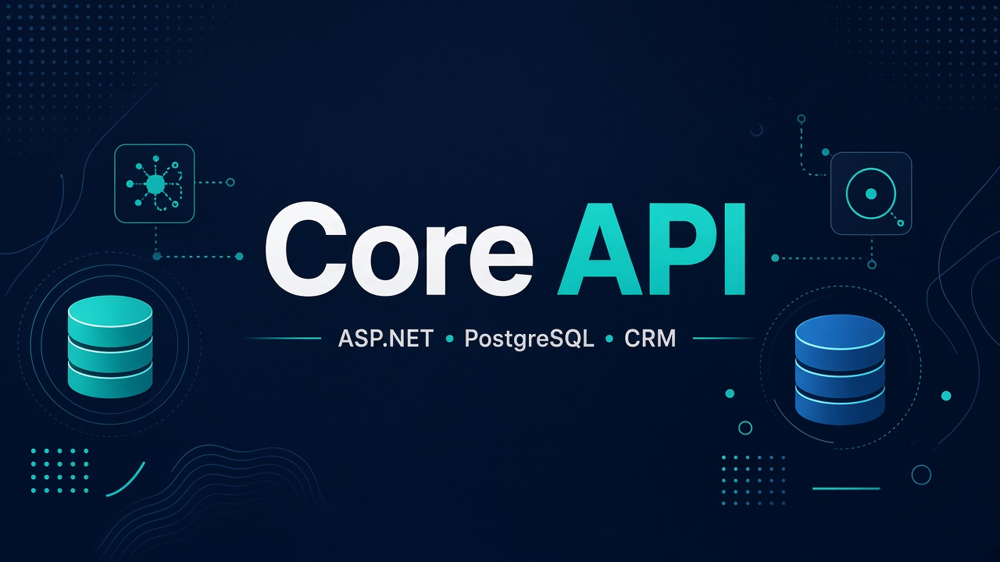

# Core API

**Role:** Backend / platform  
**Status:** Production  
**Stack:** C# · ASP.NET Core · EF Core · PostgreSQL · Hangfire · CRM REST · Mail API · OCR/LLM helpers

## Overview

Central REST API for the fintech platform. Powers the client mini app, operator admin, bots, and lawyer analysis flows.

## What I built

- User & deal lifecycle (registration, documents, e-signature, statuses)
- Background jobs (Hangfire) for CRM sync and notifications
- Credit-bureau report parsing (NBKI / OKB / SB) and PDF-related workflows
- Telegram / MAX bot integration
- Client work-mailbox provisioning via self-hosted mail API
- Category guards so CRM writes stay in allowed pipelines

## Results

- Single source of truth for clients, deals, and integrations
- Stable public HTTPS API behind a reverse proxy
- Shared backend used by multiple frontends without duplicating business logic

## Hard problem

**Unreliable bureau parsing & CRM side effects** — wrong field mapping (e.g. SMP vs overdue) and accidental writes into partner/installment funnels.  
**Fix:** iterated parsers with debug rebuild loops + hard allow/block lists for CRM categories.

## Confidentiality

No source code, connection strings, tokens, or internal field IDs are published here.
