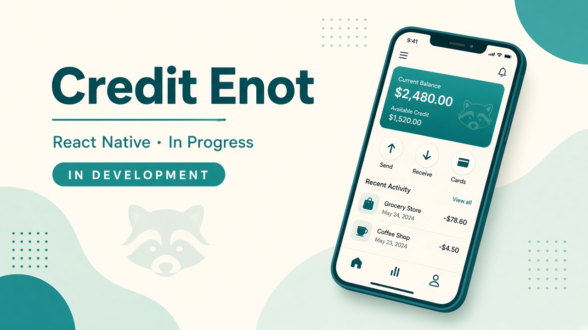
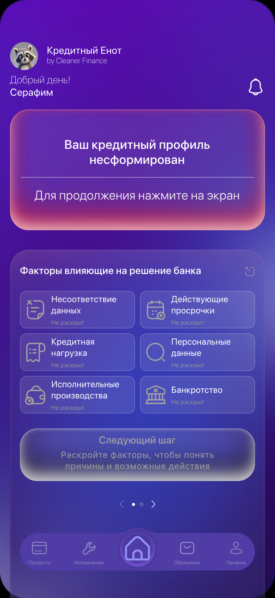

# Credit Enot — B2C App *(in development)*

## Screenshots

In-development mobile UI (demo mode, synthetic user name).

**Role:** Product / architecture / mobile  
**Status:** 🚧 **In active development**  
**Stack:** React Native (Expo) · ASP.NET Core API · Python claims & mail services

## Overview

New isolated **B2C** product line (“Credit Enot”). Intentionally **not** wired into the legacy mini-app / partner / CRM stack (except shared mail infrastructure where needed).

## What is already in place

- Mobile app shell: OTP auth (stub/demo), onboarding goals, bureau report upload, income questions
- Home: carousel → rating/profile after onboarding steps
- Custom tab bar and time-limited promo offer UI (per-user local timer)
- Report notice badge states (outdated reports / bureau reply / none) — backend rules in progress
- Separate deploy compose for API, claims, and mail agent
- Product decisions & screen-flow docs

## What I’m building next

- Server-side promo/offers and notice kinds
- Hardening auth beyond demo OTP
- Store builds (EAS) when product-ready

## Design constraints learned early

- Don’t swap full tab-bar state SVGs (home icon “jumps”) — animate glow only
- Prefer PNG glows over broken SVG filters on web
- Keep this stack isolated from legacy production blast radius

## Confidentiality

No private keys, store credentials, or production client data. This case study describes scope and architecture only.
