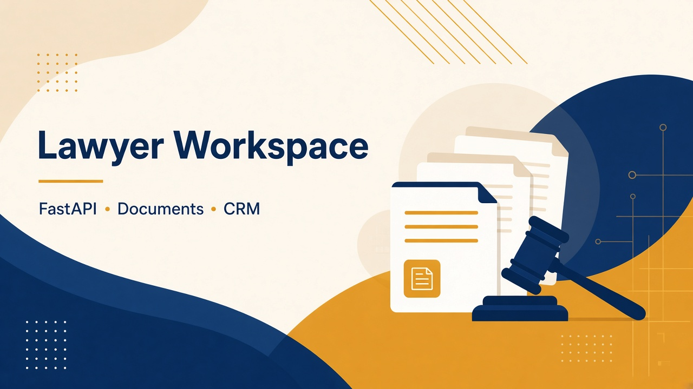

# Lawyer Workspace + Mail Agent

**Role:** Full-stack  
**Status:** Production  
**Stack:** FastAPI · Web UI · CRM sync · OCR · DOCX generation · mail agent · LLM OCR helpers

## Overview

Workspace for lawyers: sync deals from CRM, analyze credit reports, build dispute matrix, generate claim letters, send/receive bureau mail under human control.

## What I built

- Pipeline: **Sync → Report → Matrix → Claims → Send**
- Bitrix deal sync with document completeness checks
- Claim generation (DOCX) and optional CRM writeback
- OpenClaw-style mail agent colocated with the lawyer stack (controlled sending)

## Results

- Lawyers can run complex cases without relying only on a blind robot
- One ownership boundary for agent + deal work files (fewer port/secret conflicts)

## Hard problem

**Split ownership of the mail agent between automation and lawyer stacks** caused port conflicts and secret drift.  
**Fix:** moved agent + workspace into the lawyer stack; kept the Bitrix robot optional for mass automation.

## Confidentiality

Login screenshot only. No deal PDFs, passports, or letters are published.
