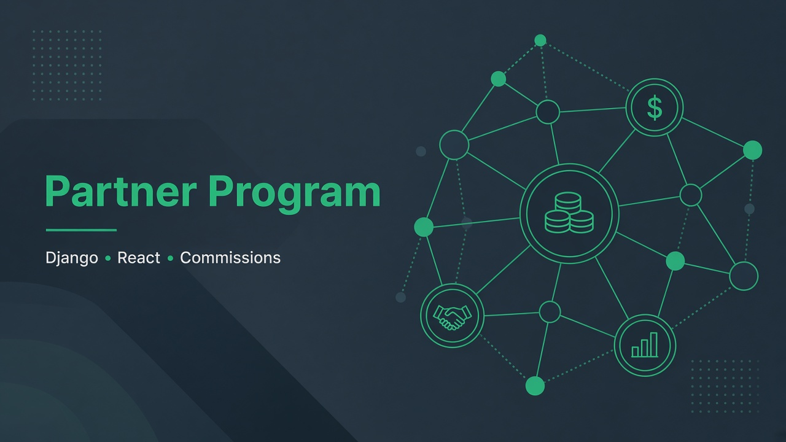
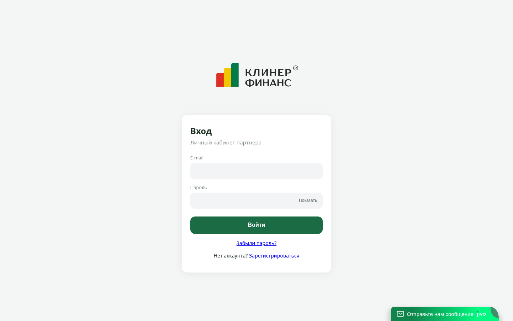
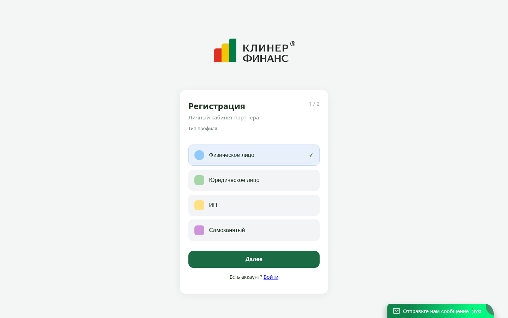

# Partner Program (PRM)

## Screenshots

Public partner auth & onboarding step 1 (profile type).

**Role:** Full-stack  
**Status:** Production  
**Stack:** Django · DRF · JWT · React · TypeScript · PostgreSQL · CRM webhooks

## Overview

Partner registration, partner cabinet, admin offers, and commission accrual from CRM deal events.

## What I built

- Partner + admin portals (separate DB from the core product API)
- Outgoing CRM webhooks for deal add/update → commission rules
- Partner card sync in a dedicated CRM funnel
- Attribution fields with fallbacks when payment forms write different CRM custom fields

## Results

- Live partner portal with transparent reward logic
- Commissions can accrue on configured stages — not only on “won”

## Hard problem (most critical)

**Duplicate partner payouts on installment deals.**  
After payment, deals returned from a service installment funnel into the main pipeline and re-triggered webhook accruals.  
**Fix:** hard rules — **no accrual** on the installment service category; **no re-accrual** when returning to the main funnel; UF fallbacks so Tilda/payment attribution is not lost.

## Confidentiality

Login screenshot only. No partner balances, rates, or deal IDs.
