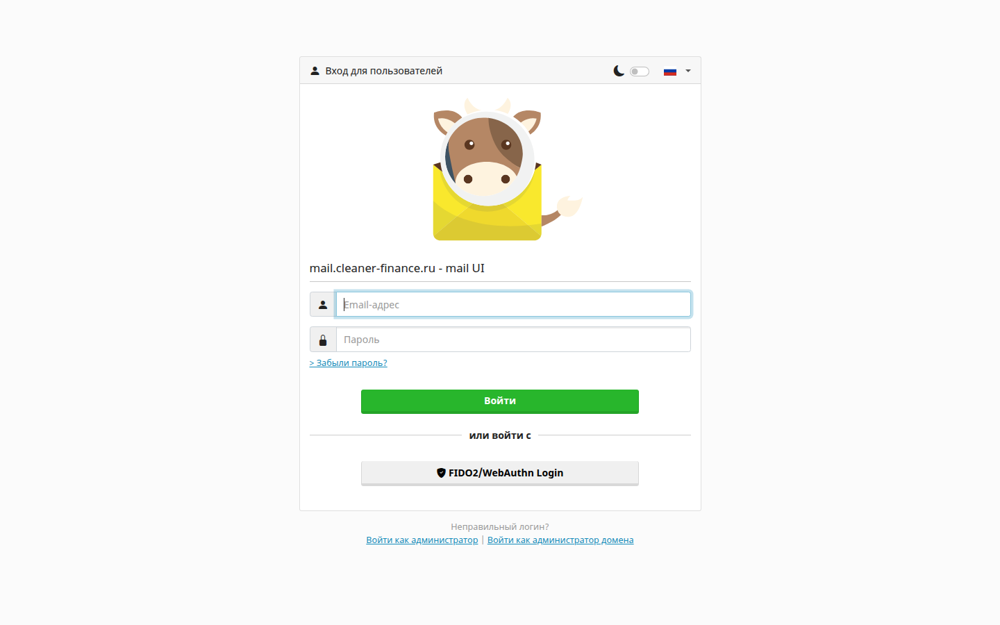
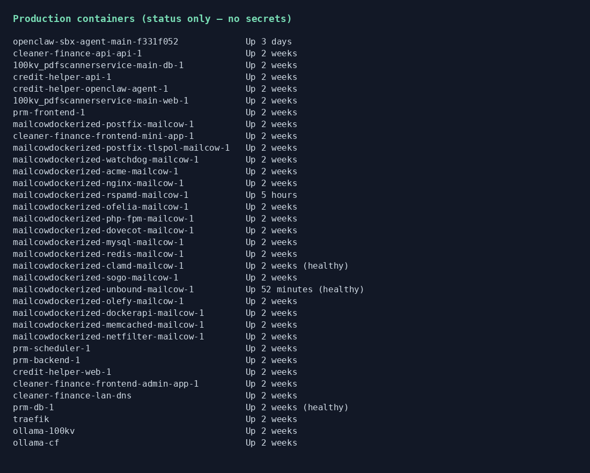

# Production Infrastructure

## Screenshots

Self-hosted mail UI + production container status (names/status only).

**Role:** DevOps / platform  
**Status:** Production  
**Stack:** Docker Compose · Traefik (HTTPS) · self-hosted mail · split DNS · backup scripts

## Overview

Self-hosted production for all platform services on one server: reverse proxy, TLS, databases, mail, office DNS, reboot bring-up, backups.

## What I built

- Multi-stack compose orchestration in a correct boot order
- HTTPS termination and host-based routing
- Self-hosted mail for app SMTP and client work mailboxes
- DB backup script across product databases + mail DB
- Inactive mailbox purge policy
- Office split DNS so domains resolve to LAN IP without breaking marketing DNS
- Remote-friendly runbooks (`AGENTS` / `COMMANDS`-style docs)

## Results

- All public products on HTTPS with health-checkable URLs
- Recoverable reboot procedure
- Documented incident playbooks (mail, mini-app deploys, quotas)

## Hard problems

| Issue | Fix |
|-------|-----|
| Host Postfix occupied `:25` after reboot → mail container dead | Mask host Postfix; recreate mail Postfix; checklist |
| Domain mailbox quota exhausted → registration without mailbox | Raise domain quota; smaller default mailbox; purge idle boxes |
| Gmail `550 NotAuthorized` despite green SPF/DKIM | Diagnosed as **IP reputation** → relay/smart-host path, not “tweak DNS and hope” |
| Accidental host DNS edits can kill office internet | Diagnose-only rule unless explicitly approved |

## Confidentiality

No server IPs required here, no `.env`, no ACME private material, no API keys.
